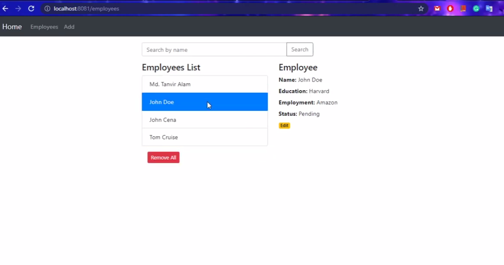
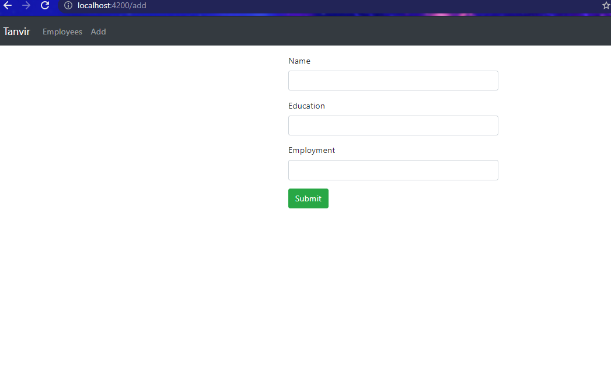
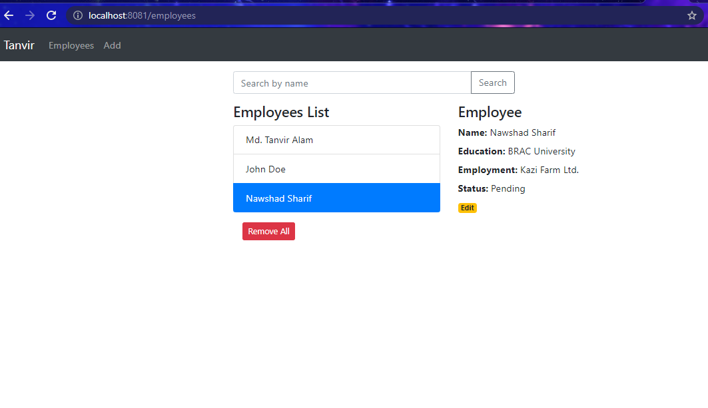
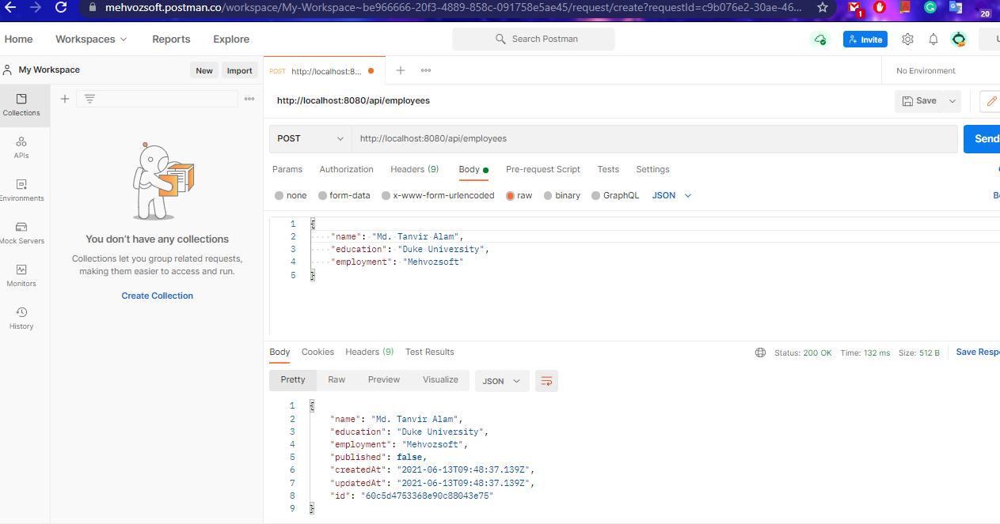
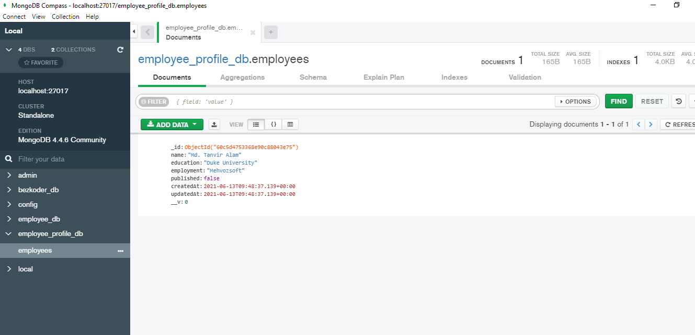

# Employee profile management system

Fullstack MEAN application using Angular 12.
It can do basic crud operations on mongodb database.

## How To Use
Clone this repo.
Go to backend folder and run ``` npm install```
Then run ```node server.js```
Then go to frontend folder and run ```npm install```
Then run ```ng serve --port 8081``` 
Make sure you install mongodb first.
And run ```mongod``` and ```mongo``` on your local machine

## Youtube Demo
[](https://youtu.be/eQllGA-97Po)


## Screenshots are given below both frontend and backend



## List of Employees


## API Test with Postman


## Mongdb database with Compass
